# MM1: Methods, Analysis & Insights from Multimodal LLM Pre-training

*Apple*

> Brandon McKinzie◦, Zhe Gan◦, Jean-Philippe Fauconnier⋆, Sam Dodge⋆, Bowen Zhang⋆, Philipp Dufter⋆, Dhruti Shah⋆, Xianzhi Du⋆, Futang Peng, Floris Weers, Anton Belyi, Haotian Zhang, Karanjeet Singh, Doug Kang, Hongyu Hè, Max Schwarzer, Tom Gunter, Xiang Kong, Aonan Zhang, Jianyu Wang, Chong Wang, Nan Du, Tao Lei, Sam Wiseman, Mark Lee, Zirui Wang, Ruoming Pang, Peter Grasch⋆, Alexander Toshev†, and Yinfei Yang† Apple bmckinzie@apple.com, zhe.gan@apple.com ◦First authors; ⋆Core authors; †Senior authors

## 摘要

本项工作，讨论了高性能的多模态大型语言模型（MLLMs）。研究了不同架构组件和数据选择的重要性。

通过对**图像编码器**、**视觉语言连接器**以及**各种预训练数据选择**进行细致全面的消融实验，我们识别出了几个关键的设计经验。
1. 例如，我们展示了对于大规模多模态预训练，使用精心混合的图像-标题、交错的图像-文本和仅文本数据对于在多个基准测试中达到最先进（SOTA）的小样本结果至关重要，与其他已发布的预训练结果相比。

2. 此外，我们展示了图像编码器以及图像分辨率和图像标记数量对性能有着实质性的影响，而视觉-语言连接器设计相比之下的重要性却微乎其微。

通过扩展我们所提出的配方，我们构建了MM1，这是一个多模态模型家族，包含了高达30B参数的密集型模型和混合专家（MoE）变体，这些模型在预训练指标中居于SOTA水平，并在一系列既定的多模态基准测试中通过有监督微调后取得了竞争性能。

得益于大规模预训练，==MM1具备了诸如增强的上下文学习和多图像推理等吸引人的特性，使其能够实现少样本链式思维提示。==

## 1.引言

### **为什么做这个研究？**

1. 因为这是趋势
2. 多模态这块开放程度不够，没有透漏多少算法设计选择的过程

### **所以本研究就主要专注在以下两点，并进行了小规模的消融实验，并且发现了有趣的趋势：**

1. 模型架构决策
2. 预训练数据选择

#### 在**<u>*模型架构决策*</u>**方面

我们发现设计需要遵循的重要性顺序依次是：==图像分辨率，视觉编码器的损失和能力，视觉编码器的预训练数据==。

令人惊讶的是，我们几乎没有找到证据表明，视觉数据如何输入到大型语言模型（LLM）的架构决策有关紧要。

#### 在**<u>*预训练数据选择*</u>**方面，用了三种数据：

1. 图片-标题
2. 交错图片-文本
3. 仅文本
在小样本学习和仅文本表现方面，交错和仅文本训练数据极为重要，而对于零样本表现而言，标题数据最为关键。

并且证明，这些趋势在经过监督细调（SFT）后依旧保持不变，不仅适用于预训练中使用的评估，也适用于其它进一步的基准测试。

这表明在预训练期间发现的能力和建模决策在细调之后得以保留。

### 最后，我们通过使用更大的LLM来扩展我们的模型

从3B、7B扩展到30B，并探索多专家混合模型（MoE），从具有64个专家的3B MoE扩展到具有32个专家的7B MoE。这导致了一系列高效能的模型系列，在我们所知的大多数相关研究中表现出色。特别是，预训练模型MM1是SOTA，表现优于Emu2 [106]、Flamingo [3]和IDEFICS [47]在微调设置下的字幕和视觉问答（VQA）任务上，无论是小规模还是大规模。通过SFT之后的终极模型在12个既定的多模态基准上实现了竞争性能。

多亏了大规模多模态预训练，如图1和图2所示，MM1具有诸如上下文预测、多图像和思维链推理等吸引人的特性。MM1还在经过指令调整后，具备了强大的小样本学习能力。这些优异的结果证明了，构建MLLM的这一方法论把设计原则转化为了一个在大规模上具有竞争力的模型。我们希望，尽管具体的建模组件和数据源可能会演变，但这些提出的见解仍将保持相关性。

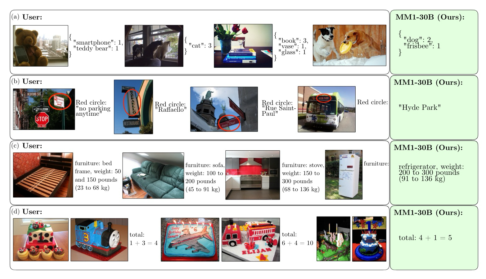

*图 1：由于其大规模多模态预训练，MM1能够进行上下文预测。这使得MM1能够（a）计数物体并遵循自定义格式，（b）指代图片中的部分并执行OCR，（c）展示关于日常物体的常识和词汇知识，以及（d）执行基本的数学功能。图片来自COCO 2014验证集[72]。*

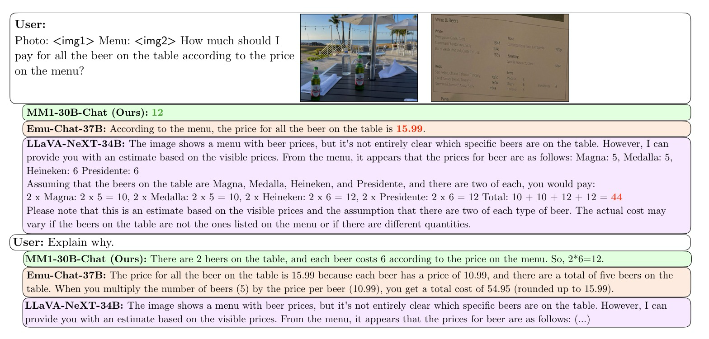

*图 2：MM1 能够遵循指令并在多个图像之间进行推理。示例和图像来自 VILA [71]；当给出思维链提示时，VILA 能够给出正确答案。*

## 3.建造MM1的配方

建设高性能的MLLM是一项高度经验性的工作。尽管高层次的架构设计和培训程序是明确的，但它们的具体形式和执行则不然。==在这项工作中，我们展示了为了得到一个高性能模型我们进行的消融实验的细节。我们探索了设计决策的三个主要轴心==：

- 架构：我们研究不同的预训练图像编码器，并探索将LLMs与这些编码器连接的各种方式。
- 数据：我们考虑不同类型的数据及其相对的混合权重。
- 训练程序：我们探讨如何训练MLLM，包括超参数以及在什么阶段训练模型的哪些部分。

### 3.1 实证设置用于消融实验

由于训练一个大型MLLM可能需要大量资源，我们简化消融实验。

更具体地说，我们使用我们的模型的一个较小的基础配置作为我们的消融研究起点。我们一次修改一个组件，不管是架构模块还是数据源，并评估这些组件设计选择的影响。这让我们能够确定最终的模型-数据配置，然后对其进行放大，无论是在模型参数还是训练时间方面。用于消融的基础配置如下：

- 图像编码器：使用CLIP损失[91]在DFN-5B[31]和VeCap-300M[56]上训练的ViT-L/14 [27]模型；图像尺寸为336×336。
- 视觉-语言连接器：具有144个图像令牌的C-Abstractor [12]。
- 预训练数据：包括有配字幕的图像（45%）、交错的图文文件（45%）以及仅文本（10%）数据。
- 语言模型：一个1.2B的仅限转换器解码器语言模型。

为了评估不同设计决策，我们使用零样本和少量样本（4样本和8样本）性能在多种视觉问答（VQA）和图像描述任务上：COCO 图像描述[18]，NoCaps[2]，TextCaps[104]，VQAv2[38]，TextVQA[105]，VizWiz[39]，GQA[46]以及OK-VQA[82]。

### 3.2 模型结构消融(研究)

在这项工作中，我们分析了使得大型语言模型（LLM）能够处理视觉数据的组件。具体来说，我们研究（1）如何最佳地预训练一个视觉编码器，以及（2）如何将视觉特征与大型语言模型的空间连接起来（见图3，左侧）。

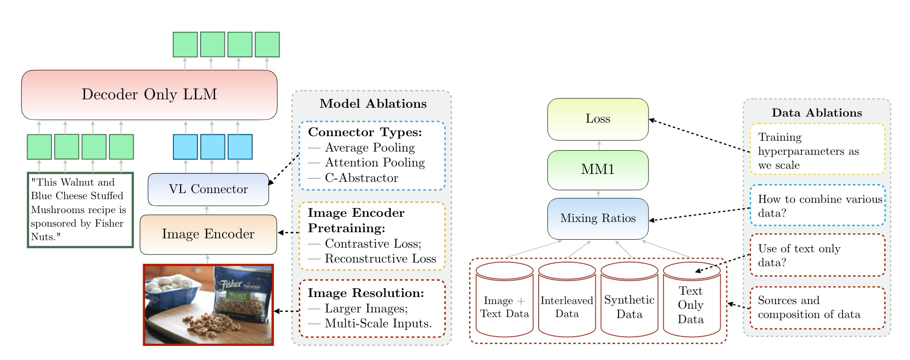

*图 3：左图：模型消融研究：应使用何种视觉编码器、如何提供丰富的视觉数据、以及如何将视觉表征与大型语言模型(LLM)连接。右图：数据消融研究：数据类型及其混合。*

#### 图像编码器预训练

大多数多模态大型语言模型（MLLMs）使用CLIP预训练的图像编码器[24, 74, 76, 124]，而近期的工作也开始探索仅视觉的自监督模型，例如DINOv2[73, 109]，作为图像编码器。与这些先前的研究相似，我们发现预训练图像编码器的选择可以在多模态预训练后和指令调优后显著影响下游结果。在这里，我们主要分析了图像分辨率和图像编码器预训练目标的重要性。在这里我们使用了一个2.9B的LLM（而不是1.2B），以确保有足够的能力来利用一些较大的图像编码器。

##### 对比损失

当在大规模图像文本数据集上训练时，由此产生的模型显示出对图像数据的强大语义理解，这一点通过在各种形式的图像分类和检索任务上的表现得以证明[91]。这些结果得益于大规模图像文本数据的可用性，它可以为视觉编码器赋予语义知识。更近期的自动策划的大规模数据集和合成标题使得编码器变得更加强大[31, 56]。

##### 重建性损失

在密集预测领域，CLIP风格的模型很难达到同样强大的性能[94, 95, 113]。这一特点对于MLLMs可能构成问题，因为很多任务比如视觉问答（VQA）和图像描述需要对图像进行详细理解。因此，我们也考虑了使用重建性损失学到的图像编码器，因为这类损失显式捕捉图像的所有部分。特别地，我们利用了AIM[30]，它已经显示出一个精心设计的自回归重建性损失仅在图像数据上就能很好地扩展。

#### 编码器的结论：图像分辨率对性能影响最大，其次是模型大小和训练数据组成。

如表1所示，将图像分辨率从224提高到336，几乎在所有架构的所有指标上可以获得约3%的提升。将模型大小从ViT-L增加到ViT-H，参数翻倍，通常只能带来不到1%的性能提升。最后，增加VeCap-300M [56]，一种合成字幕数据集，在少量样本情况下能够带来超过1%的提升。

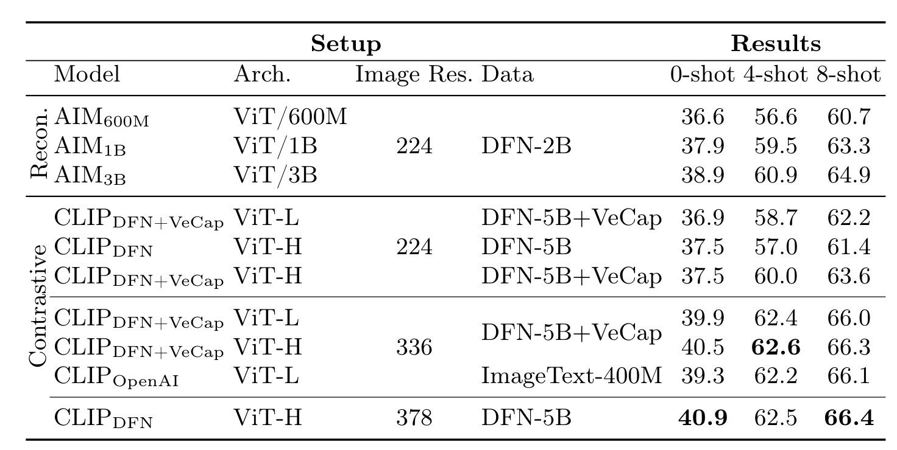

*表 1：使用2.9B LLM的MM1预训练消融研究，涉及不同图像编码器。请注意，数据列中的数值对应于图像编码器本身最初训练所用的数据，而非MM1。Recon：重构损失。AIM：[30]；DFN-2/5B：[31]；VeCap：VeCap-300M [56]；OpenAI [91]。*

在模型类型方面，结果不太确定。对比方法往往比重建方法有更高的性能。特别是基于ViT-L的3亿参数的编码器与相同规模的AIM600M（只有24个AIM模型中的20个在推理中使用层）相比，性能提高了0.3%到1.5%。然而，这一结论对于AIM的潜力尚无定论，因为它接受的训练数据还不到一半。同样，广泛使用的开源OpenAI模型[91]的表现与我们的模型相当，但我们的模型是在DFN+VeCap数据混合上训练的。

#### 视觉-语言连接器与图像分辨率

本组件的目标是将视觉表示转换到 LLM 的空间。由于图像编码器是 ViTs，它们的输出要么是单个嵌入，要么是一组与输入图像补丁相对应的网格排列嵌入。==因此，需要将图像标记的空间排列转换为 LLM 的序列排列。同时，实际的图像标记表示要映射到词嵌入空间。==

在这样做时，存在两种相互矛盾的需求。一方面，我们希望从图像中捕获尽可能多的细节，这可以通过增加图像标记嵌入的数量来实现。另一方面，特别是在多图像输入的情况下，每张图像都有大量输入标记在计算上是具有挑战性的。

我们考虑使用64或144个标记来表示图像，以及两种不同的图像分辨率：224和336。进一步地，我们考虑以下架构选项：

**平均池化**

根据[106]的方法，我们在ViT图像编码器的输出上应用n×n平均池化，然后进行线性投影（n ∈ {8, 12}）。

**注意力池化**

由于图像标记表示与LLM输入嵌入存在不同的空间，因此使用k个可学习查询进行注意力池化是一种自然的方法。通过改变k的值，可以改变从单个图像输入到LLM中的输入数量（我们使用k ∈ {64, 144}）。

**卷积映射**

最近，Honeybee [12] 研究了上述问题，并提出了C-Abstractor模块。它作为ResNet [41]块实现，能够保留局部信息，同时通过自适应池化改变图像标记的数量。

#### VL连接器结论：视觉令牌的数量和图像分辨率最为重要，而VL连接器的类型影响甚微。

图4中展示的结果表明，随着我们增加视觉令牌数量或/和图像分辨率，零和小样本性能均有所提升。然而，与文献[12]中的报道相反，不同的架构设计似乎并未明确产生更强大的效果。

经过指令调优后，所有三种架构在336px和114个令牌的设置下都取得了非常相似的结果。（详细的调优结果见附录图10。）

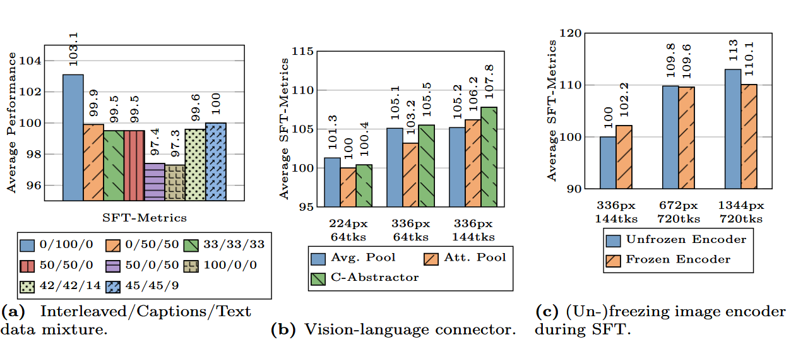

*图 10：SFT消融实验。(a) 预训练数据混合对SFT结果的影响。此处x/y/z表示数据中x%是交错的，y%是标题，z%是纯文本。tks：图像令牌的数量。(b) 不同视觉-语言连接器对SFT结果的影响。对于(a)和(b)，我们首先用消融设置对MM1-3B模型进行预训练，然后对预训练的模型进行SFT。(c) 在SFT过程中冻结或解冻图像编码器。*

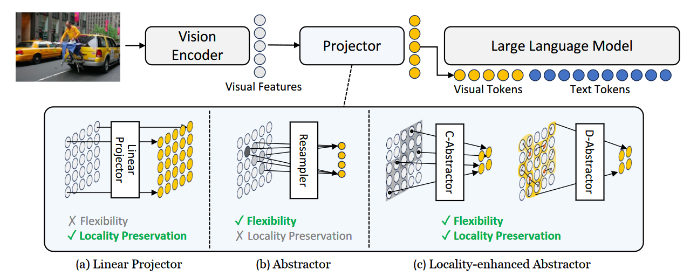

> 来自Honeybee的截图 c-Abstractor

### 3.3 预训练数据消融

在培训性能模型时，大规模且适合特定任务的数据至关重要。通常，模型的训练分为两个阶段，预训练和指令调优。在预训练阶段使用的是网络规模的数据，而在指令调优阶段则利用特定任务的精选数据。在下文中，我们将重点关注预训练阶段，并详细说明我们的数据选择（见图三，右侧）。

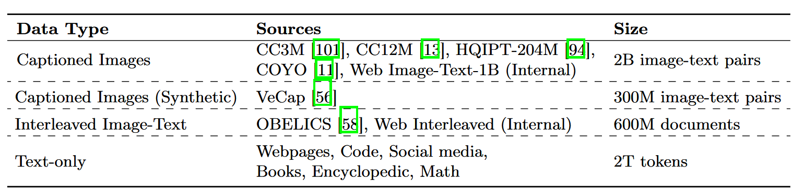

*表2：用于预训练多模态大型语言模型的数据集列表。*

通常用于训练MLLM的数据有两种类型：包含与图像配对的文字描述的字幕数据；以及从网页上获得的交错的图文文档（详见附录A.1）。请注意，字幕数据通常包含与图像高度相关的较短文本。相反，交错数据包含的文本通常较长且更多样化，与周围图像的相关性平均而言较低。最后，我们包括了仅限文本的数据，以帮助保持底层LLM的语言理解能力。所有数据集的完整列表总结在表2中。

> A.1 交错图像文本数据
>
> 我们遵循与OBELICS [58] 类似的过程，==**构建了一个包含500M个交错图像文本文件的数据集，其中包含1B张图片和500B个文本tokens。**==这500M个文件是基于在第A.2节中所述的3B个HTML文件集合构建的。我们从每个HTML文件中提取文本正文层和所有的标签。我们删除那些没有图片或者包含超过30张图片的文件。然后，我们下载这些图片，并将它们插入回文本中它们最初的位置。最后，我们进行图像筛选和图像去重复处理，以移除低质量和重复的图片。在图像筛选过程中，我们去除那些具有损坏的byte和/或头部、纵横比小于1/2或大于2、过小（小于100px）或过大（大于10,000px）、或URL包含logo、按钮、图标、插件或小部件的图像。在图像去重复的过程中，我们移除那些URL或MD5哈希在数据集中出现超过10次的图片。另外，当一张图片在同一个页面上多次出现时，我们只保留它的第一次出现。

> A.2 仅文本数据 
>
> 从最初的1500亿英文HTML文件的Web语料库中，我们执行样板代码移除，得到代表主要内容的HTML。然后，我们遵循与GPT-3[10]和CCNet[119]相似的过程，过滤掉过短、包含不雅词汇或其他被认为是低质量文档的文件。我们使用精确哈希匹配和基于LSH的近似重复检测对数据进行去重。采用这些方法，我们得到了30亿HTML文件。

我们使用与第3.1节中描述的消融实验相同的模型设置，唯一的区别是我们在此训练了20万步，以充分利用大规模数据训练。我们还纳入了一系列常用的文本任务，被称为TextCore1，作为评估的一部分，以更好地评估数据混合的效应。这些导致了以下教训：

#### 数据结论1：交错数据对于小样本和纯文本性能至关重要，而标注数据提升了零样本性能。

在<a href="#图5">图5</a>a中，我们展示了不同混合的交错数据和带字幕数据的结果。零样本性能从25.8%稳步提升至39.3%，随着我们增加带字幕数据的量。然而，同样地，对于4样本和8样本性能来说，至少有50%的数据是交错的，对于保持8样本性能在61%以上或4样本在58%以上至关重要。没有这些数据，性能分别骤降至45%和43.7%。由于交错数据自然包含多个图像及其配套文本，这些内容往往是相互关联的，因此这类数据本质上与少样本测试输入相似，这一点与实证结果对齐得很好，由于常见评估的性质主要针对字幕问题（8个基准测试中有3个是字幕），因此字幕数据显著提升了零样本性能。有趣的是，在少样本设置中，使用交错数据进一步提升了对这些相同字幕基准的性能。同样，纯文本性能也因交错数据而受益，这可能是因为交错数据同样包含长篇文本。

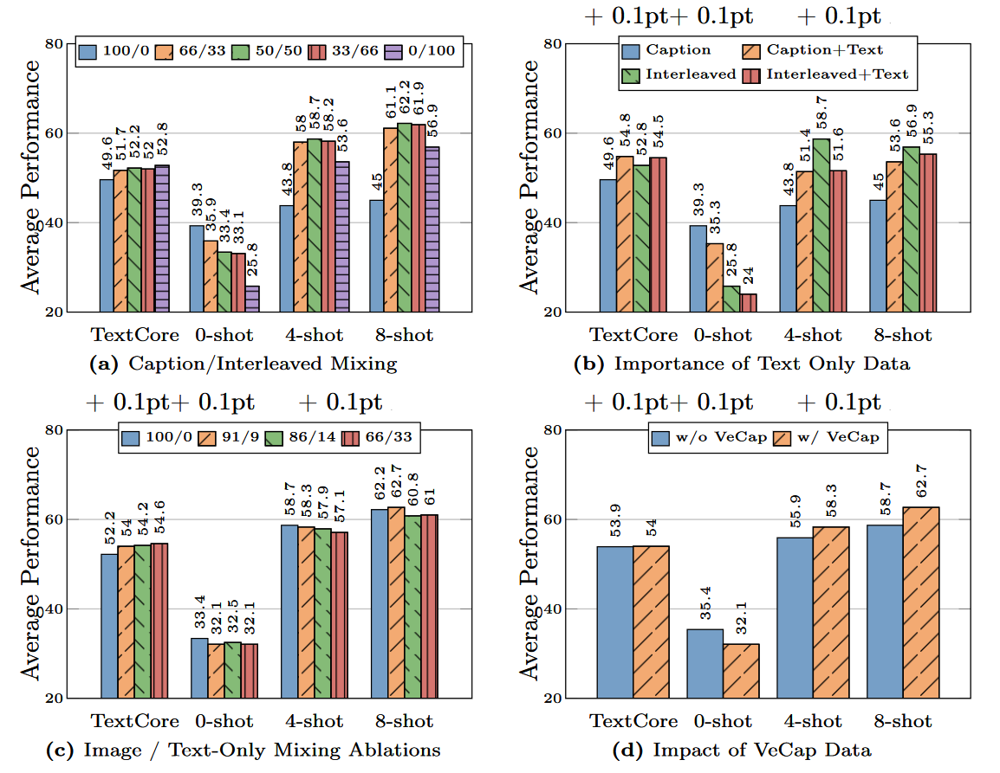

*<a name="图5">图5</a> ：数据消融。对于每一种消融，我们展示了四个不同的指标：TextCore、0次射击、4次射击、8次射击。 (a) 图像数据的结果，我们展示了交错数据和带字幕数据之间五种不同的混合比例。 (b) 有无仅限文本数据的结果。我们将文本数据分别与有字幕数据和交错数据混合。 (c) 图像数据（字幕和交错）与仅限文本数据之间不同混合比例的结果。 (d) 在带字幕数据中包含与不包含VeCap的结果。*

#### 数据结论2：仅文本数据有助于小样本学习和仅文本表现。

我们使用仅文本数据来维持模型的语言理解能力。如<a href="#图5">图5</a>b所示，结合仅文本数据和带有标题的数据可以提升少量样本的性能。换句话说，长文本确实允许模型使用多个图像和文本示例作为上下文，以更好地进行问题回答和图像说明。另一方面，将仅文本数据与交错数据结合使用会导致性能下降，尽管只是小幅下降。

#### 数据课程3：谨慎混合图像与文本数据可产生最佳的多模态性能，并保持强大的文本表现。

上述课程引出了一个问题，即如何最好地结合仅文本数据以实现强大的图像和语言理解。在图5c中，我们尝试了图像（图说和交错）与仅文本数据之间的几种混合比例。我们看到，当字幕/交错/文本的比例为5:5:1时，我们实现了强大多模态性能的良好平衡，同时仍保持了可比的仅文本理解性能。

#### 数据课程4：合成数据助力小样本学习

最后，我们研究了合成字幕数据VeCap [56]的重要性。尽管其质量较高，但相对较小，仅占所有字幕数据的7%。如图5d所示，它确实在少量样本性能上提供了非微不足道的提升，分别为2.4%和4%的绝对值。

## 4 最终模型与训练配方

我们收集之前消融实验的结果，以确定MM1多模态预训练的最终配方：

- 图像编码器：由于图像分辨率的重要性，我们使用了一个预先训练有CLIP目标的ViT-H [27]模型，分辨率为378x378px，在DFN-5B [31]上进行了预训练。
- 视觉-语言连接器：由于视觉标记的数量至关重要，我们使用了具有144个标记的VL连接器。实际的架构似乎不太重要，我们选择使用C-Abstractor [12]。
- 数据：为了保持零样本和少样本性能，我们使用了以下精心搭配的数据混合：45%交错的图像-文本文档，45%图像-文本配对文档以及10%纯文本文档。

*图 6：最佳峰值学习率作为模型大小的函数。数据点代表实验，这些实验达到了与它们相关联的模型大小接近最佳的8-shot性能。*

为了提升模型性能，我们将大型语言模型（LLM）的规模扩大到3B、7B和30B参数。底层的LLM在同一文本数据集上进行了内部训练（见第3.3节）。由于大型语言模型和视觉编码器都已预训练，我们将它们作为多模态模型MM1的初始化，并在上述混合数据上进行了20万步（约1000亿token）的多模态预训练。所有模型均在未冻结的状态下完全预训练，序列长度为4096，每个序列最多包含16幅图像，分辨率为378×378，批处理大小为512个序列。所有模型均使用AXLearn框架进行训练。

### **模型缩放**

在此规模下，进行适当的超参数搜索是不可行的。相反，我们利用已确定的大型语言模型（LLMs）的缩放特性[43, 44, 121, 122]，在较小规模（9M、85M、302M和1.2B）上进行学习率的网格搜索，同时使用第3.23节识别的组件来确定最佳学习率，并将其外推到更大的规模。我们在对数空间中使用线性回归，从小型模型外推到大型模型（见图6），得出以下关于最佳峰值学习率η的预测，给定数量的（非嵌入式）参数N：

> 3.23 唯一的例外是图像编码器，我们将其缩小至CLIPDFN+VeCap ViT-L336px以降低网格搜索的计算成本。

$$
\eta=\operatorname{e x p} (-0. 4 2 1 4 \operatorname{l n} ( N )-0. 5 5 3 5 )
$$

与[48]类似，我们在初步实验中发现验证损失与下游任务表现并没有强相关性。因此，我们直接使用下游8次平均表现进行曲线拟合。

对于N = 3e10，该拟合预测η = 2.2e−5，这是我们用于最终的MM1-30B模型的值。我们最初执行了类似的过程来确定权重衰减λ的合理值，但最终发现按峰值学习率缩放权重衰减的简单规则λ = 0.1η对所有模型都很有效。所有进一步的训练细节在附录B中描述。

### **通过专家混合（MoE）实现扩展**

MoE在保持激活参数不变的同时，扩大了模型参数的总数。它在不显著牺牲推理速度的情况下，享受更大的模型容量。最近，MoE在语言[23,29,32,49,135]、多模态[70,87]以及计算机视觉[16,25,55,96]任务中显示出了有希望的结果。

在实验中，我们进一步通过在语言模型的FFN层中增加更多专家来探索密集模型的扩展。我们的MoE实现通常遵循GShard[59]和ST-MoE[135]。具体来说，我们使用Top-2门控、在每个稀疏层有64/32位专家，并且在每2/4层中用稀疏层替换一个密集层。我们采用带有0.01系数的负载均衡损失项，以鼓励更好的专家负载均衡。我们还采用带有0.001系数的路由器z-loss项来稳定训练。为了将密集模型转换为MoE，我们只替换了密集语言解码器为MoE语言解码器。图像编码器和视觉-语言连接器保持不变。为了训练MoE，我们采纳了为密集型主干发现的相同训练超参数以及包括训练数据和训练令牌在内的相同训练设置。

### **多模态预训练结果**

我们通过适当的提示评估预训练模型在图像描述和视觉问答（VQA）任务上的表现。正如表3所展示，我们评估了零次和少次样本学习，并与少数几种报告过的方法进行了比较小样本预训练性能。注意，我们只将我们的模型与更大的模型进行比较，例如，将我们的30B模型与两个80B模型进行比较。

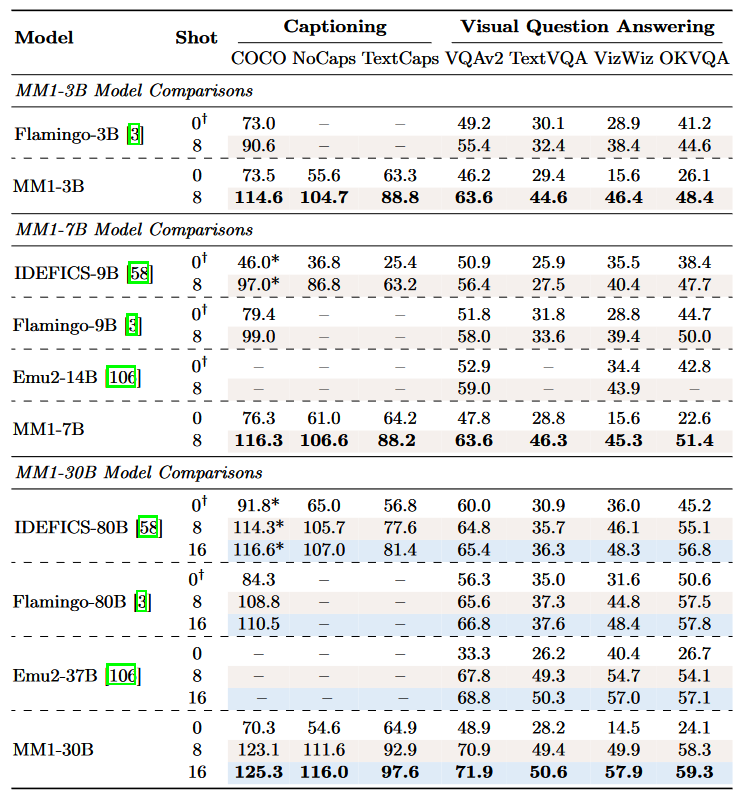

表3：多模态预训练评估。(*) IDEFICS在其训练数据中包括PMD（包括COCO）。(†) 这些模型在它们的“0”提示中包括两个仅文本的演示，而MM1则没有。完整表格见附录中的表6。

当谈及小样本性能时，MM1超越了所有已发表的预训练MLLMs之先行研究。我们观察到在30B级别的字幕基准测试和VizWiz-QA基准上的卓越性能表现。在VQAv2、TextVQA、OKVQA这些规模测试中，我们与Emu2[106]不相上下。对于零样本性能6，即使在不进行指令微调的情况下，我们的模型在TextCaps上表现出色，适用于所有模型尺寸，并且在大多数基准测试的小规模上与Flamingo-3B相媲美。

## 5 监督式微调

在本节中，我们描述了在前几节描述的预训练模型基础上进行的监督式微调（SFT）实验。

### SFT数据混合

我们遵循LLaVA-1.5 [74] 和LLaVA-NeXT [75] ，从多个数据集中收集了大约100万个SFT示例，包括

- 指令-响应对由GPT-4和GPT-4V生成，包括用于对话和复杂推理的LLaVAConv和LLaVA-Complex [76]，以及用于详细图像描述的ShareGPT-4V [15]7；

- 面向学术任务的视觉-语言（VL）数据集，包括：（i）自然图像的VQAv2 [38]、GQA [46]、OKVQA [82]、A-OKVQA [98]和COCO Captions [18]；（ii）富含文本的图像的OCRVQA [86]和TextCaps [104]；以及（iii）文档和图表理解的DVQA [51]、ChartQA [83]、AI2D [52]、DocVQA [85]、InfoVQA [84]和Synthdog-En [53]。

- 仅文本的SFT数据：我们使用一个类似于ShareGPT [100]的内部数据集，用于保持仅文本指令跟随的能力。

学术领域的VL数据集已按照指令遵循格式进行了格式化，遵循LLaVA-1.5 [74]。更多详细信息请参见附录A.3。所有数据集在训练过程中被混合在一起并进行随机抽样。

在SFT期间，我们保持图像编码器和LLM主干都不冻结；其他SFT训练细节请见附录B.2。我们根据12个基准对我们的模型进行评估（详见附录C.2）。

### 缩放至更高分辨率

直觉上，更高的图像分辨率会带来更好的性能。为了支持高分辨率SFT，我们采用了两种方法：

#### 位置嵌入插值

例如，在Qwen-VL[5]和BLIP2[65]中探讨的。在进行位置嵌入插值后，视觉变换器骨干网络适应了新的分辨率进行微调。通过这种方法，我们已经成功地微调了我们的模型以支持从448×448、560×560到672×672的图像分辨率。注意，对于672×672的分辨率，以14×14的补丁大小，一个图像用2,304个令牌表示。

#### 子图像分解

最近由SPHINX [73]、Monkey [69]和LLaVA-NeXT [75]所提出的。在超过2,000个图像标记中计算自注意力在计算上具有挑战性，这限制了进一步扩展到更高的图像分辨率。继SPHINX [73]之后，如图7a所示，对于一个高分辨率输入图像，例如1344×1344，我们构造五个672×672的图像，并将它们作为独立图像输入到我们的视觉编码器中。具体来说，我们首先将输入图像下采样到672×672作为高级表示，并将输入图像调整大小到1344×1344，然后将调整大小后的图像分割为4个672×672的子图像，这些子图像保留了更多详细的视觉信息。通过对每个子图像使用位置嵌入插值，我们可以在实验中支持高达1792×1792的图像分辨率。

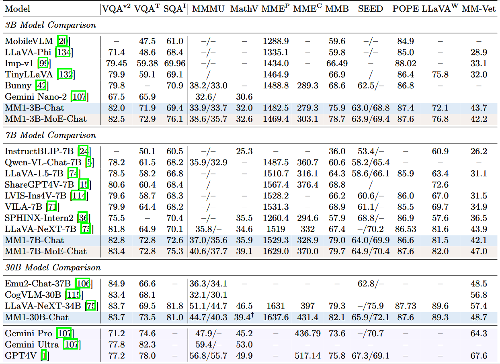

表4：与MLLM基准上的SOTA模型比较。VQAv2 [38]；VQAT：TextVQA [105]；SQAI：ScienceQA-IMG [81]；MMMU [127]；MathV：MathVista [80]；MMEP/C：MME的感知/认知拆分 [33]；MMB：MMBench [78]；SEED：SEED-Bench [62]；POPE [68]；LLaVAW：LLaVA-Bench（实际场景）[76]；MMVet [126]。在MMMU中报告的两个数字分别代表在验证集和测试集上的性能。在SEED中报告的两个数字分别代表在整个SEED-Bench和图像部分上的性能。（†）8次提示试验：44.4。

### 5.1 SFT结果：消融与分析

#### 与SOTA的比较

结果总结在表4中。我们使用“-Chat”来表示经过SFT的MM1模型。首先，平均来说，MM1-3B-Chat和MM1-7B-Chat在所有列出的同等规模模型中表现最优，为这些模型规模设立了新的艺术标准。MM1-3B-Chat和MM1-7B-Chat在VQAv2、TextVQA、ScienceQA、MMBench以及更近期的基准测试（MMMU和MathVista）上表现尤为强劲。

其次，我们探索了两种MoE模型：包含64个专家的3B-MoE和包含32个专家的6B-MoE。**我们的MoE模型在几乎所有基准测试中均比密集对应模型表现出更好的性能**。这表明MoE在进一步扩展方面具有巨大潜力，这将作为未来的研究工作。

第三，对于30B模型大小，MM1-30B-Chat 在TextVQA、SEED 和 MMMU 上超越了 Emu2-Chat37B[106] 和 CogVLM-30B[115]。与同时期的LLaVA-NeXT[75]相比，我们也在各方面实现了竞争性的表现。**然而，LLaVA-NeXT 不支持多图像推理**，也不支持少量样本提示，因为每个图像被表示为2880个令牌发送对于LLM，其总数为720。这限制了涉及多图像的某些应用。

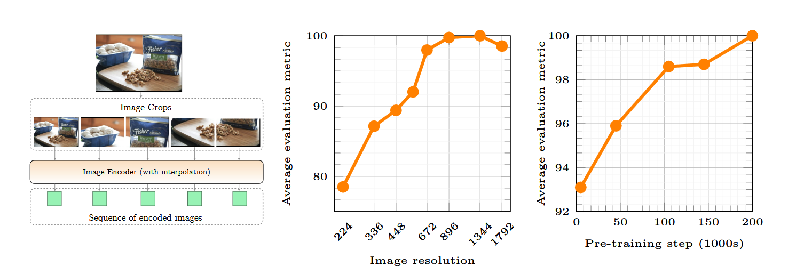

图 7：我们研究了图像分辨率和预训练对于SFT性能的影响。

#### 影像分辨率的影响

图7b展示了输入图像分辨率对SFT评估指标平均性能的影响（具体如何计算元平均的细节推迟到附录C.3）。与图像分辨率为336像素的基线模型相比，我们可以通过支持1344×1344的图像分辨率来实现15%的相对增长。请注意，对于最大的1792×1792图像分辨率，平均性能略有下降。这可能是因为许多评估图像的分辨率小于这个数值，且调整大小的工件可能会影响模型性能。

#### 影响预训练

与大多数现代大型机器学习模型（MLLMs）不同，我们对我们的模型执行了大规模预训练。为了评估预训练对最终模型性能的影响，我们在同一预训练运行中进行了SFT（稀疏微调），但在不同的检查点步骤上执行。对于一个较早的检查点步骤，模型看到的独特数据样本少于较晚的检查点步骤，因此这是衡量预训练数据数量重要性的一个指标。在图7c中，我们显示了模型随着看到更多预训练数据而一致地改善。

#### 小样本链式思维推理（SFT 之后）

如第3.3节所见，由于交错数据的原因，MM1获得了少量样本学习的能力。尽管我们的微调数据仅包含单图像示例，我们发现MM1-30BChat依然表现出多图像推理能力。这一点在图2中定性地展示出来，并且在MathVista [80]上定量分析，我们评估了使用思维链提示的少量样本性能：4样本性能达到了41.9，比零样本（39.4）高出2.5分。

我们最佳表现的高分辨率SFT模型每张图片使用720个令牌。当使用超过4个上下文示例时，由于上下文长度的原因，这是一个挑战。为了允许更多的示例，我们探索了混合分辨率上下文示例的表述方法，即我们以较低的分辨率输入一些示例（详见附录C.5）。使用这种表述方法，并增加到8个上下文示例，MathVista的性能提高到了44.4分。

#### 通过预训练获得的经验教训能否转移到SFT上？

是的。我们发现：（1）仅使用标题数据进行预训练可以提高SFT指标，以及（2）不同的视觉-语言（VL）连接器架构对最终结果的影响可以忽略不计。具体的消融实验结果在附录C.4中提供。

#### 定性分析。

为了更好地理解MM1，我们在附录D中为预训练和指令调优模型提供了更多定性示例，包括交错的图像-文本处理和少数样本推理。

## 6 结论 

我们研究了如何构建高性能的MLLMs。通过仔细剔除模型和数据选择，我们识别出一些重要教训，从而令预训练模型在多种小样本评估中取得了SOTA结果。在进行SFT之后，这一模型系列在广泛的基准测试中展现了有竞争力的表现，同时实现了多图像推理和小样本提示。我们希望这些识别出的教训能够帮助社区构建出比任何单一特定模型架构或数据策略更强大的模型。

